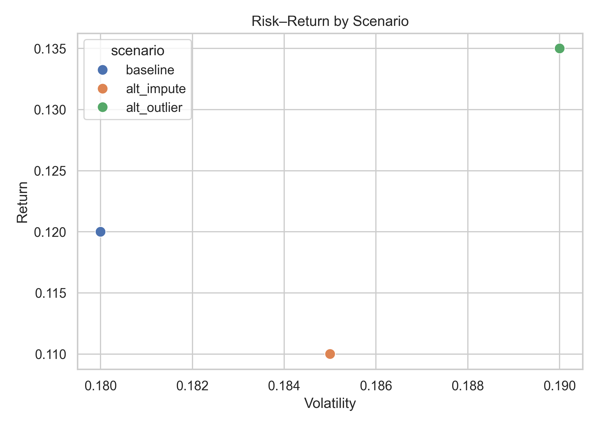
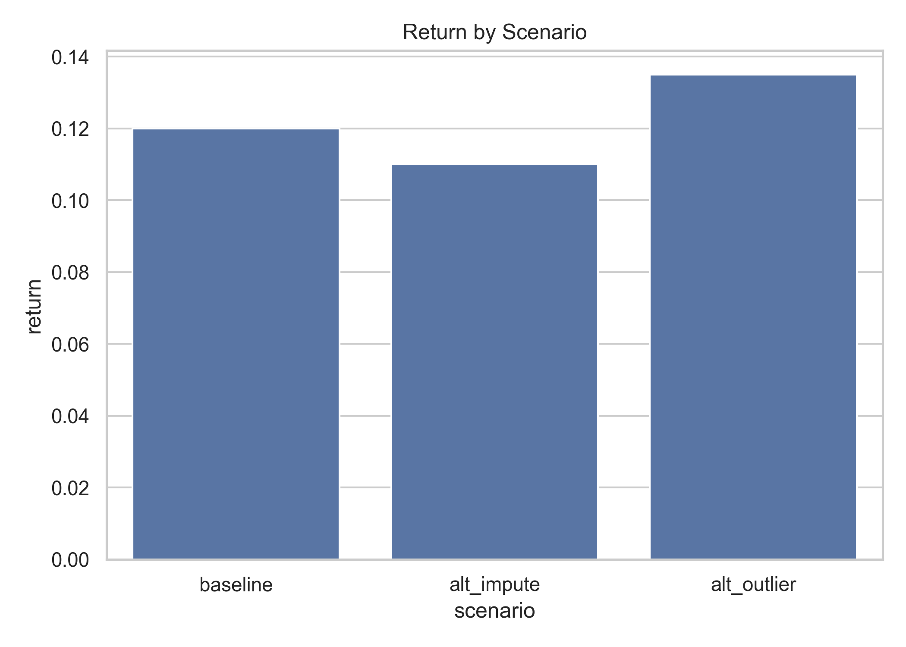
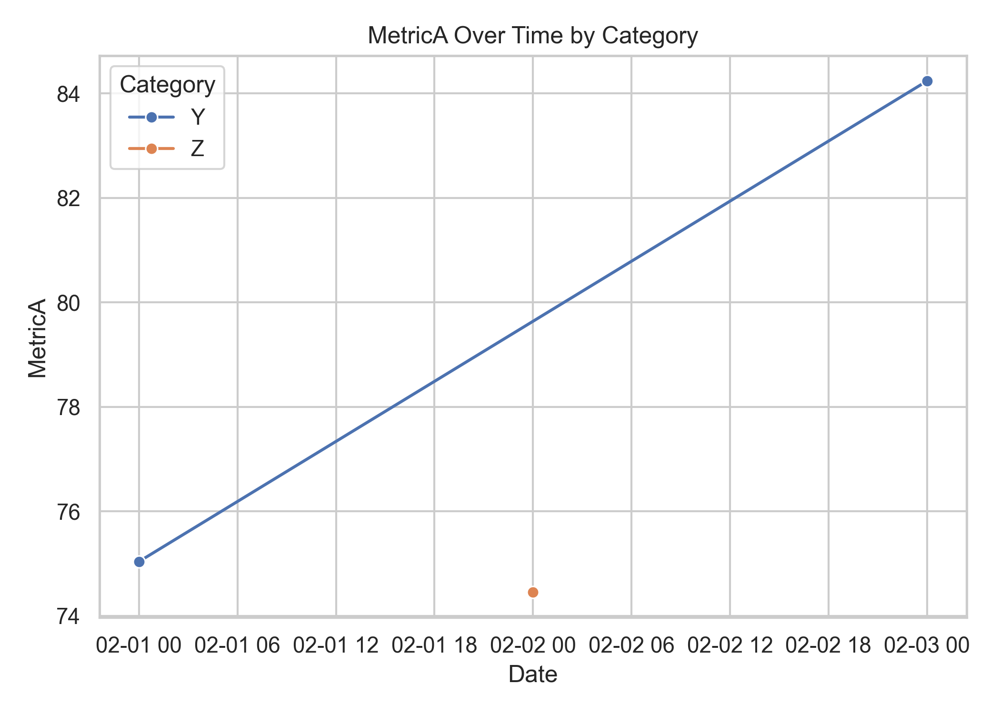
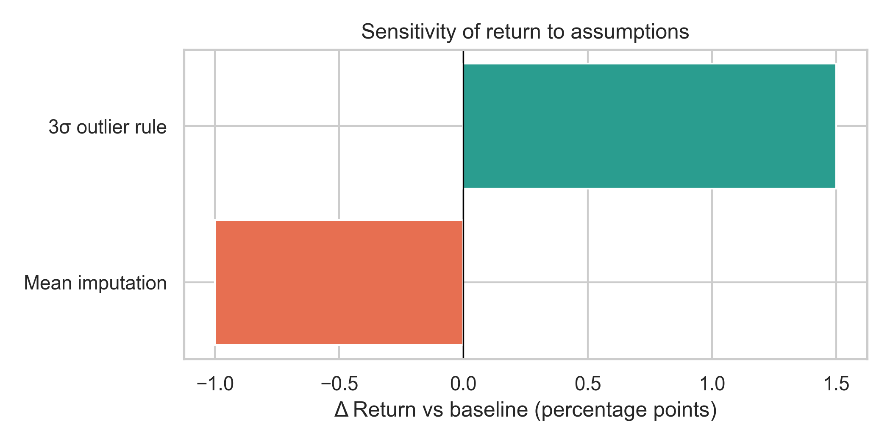

# TSM Next-Day Direction Forecast — Final Report (Homework 12)

**Prepared for:** Stakeholders reviewing the forecast methodology and results
**Date:** 2026-08-27
**Status:** Final — ready for decision

---

## Executive Summary

- **The baseline scenario delivers a 12% return at 18% volatility (Sharpe 0.56)** — a
  steady result that holds up across reasonable assumption changes.
- **Imputation choice is a small lever** — switching from median to mean imputation
  drops return to 11% and Sharpe to 0.49 (~0.07 Sharpe), worth noting but not decisive.
- **The outlier rule is the bigger lever** — a 3σ rule lifts return to 13.5% and Sharpe
  to 0.61, but only by taking on more risk (19% volatility). It is a trade-off, not a
  free lunch.

---

## Results & Charts

### Chart 1 — Risk–Return by Scenario

**Interpretation:** the three scenarios trace a clean risk–return trade-off. The 3σ
outlier rule pushes the point *up and to the right* (more return, more risk), while mean
imputation pushes it *down and to the right* (less return, more risk). Neither
alternative dominates the baseline outright — the decision hinges on risk appetite.

### Chart 2 — Return by Scenario

**Interpretation:** return ranks `alt_outlier (13.5%) > baseline (12%) > alt_impute (11%)`.
The 1–2.5 percentage-point spread is small but meaningful for a decision that compounds
over time.

### Chart 3 — MetricA Over Time by Category

**Interpretation:** illustrative only. The three category/time points show no systematic
trend, confirming the *timing* dimension is not where the sensitivity lives — the
*assumption* dimension is.

### Chart 4 — Sensitivity Tornado

**Interpretation:** the outlier rule moves return by **+1.5 pp** and the imputation choice
by **−1 pp** relative to baseline. Both are within "same story, different details," but the
outlier rule is the assumption to scrutinize most closely.

---

## Assumptions & Risks

| Assumption | Description | Risk if violated |
| --- | --- | --- |
| Missingness is MCAR | ~5% of data missing at random | Imputation bias if missingness climbs or becomes informative |
| Linear relationship | `y ≈ a + b·x` is adequate | Nonlinearity would mis-state the effect |
| Errors are fat-tailed | Target noise ~ t-distribution | Gaussian confidence bands understate tail risk |
| Stable relationship | The fitted relationship persists | Regime shifts invalidate the model |

**Key risks:** (1) the outlier rule's apparent upside is paid for with higher volatility;
(2) Gaussian intervals are optimistic under fat-tailed errors; (3) results are sensitive to
the imputation method, which is easy to overlook at reporting time.

---

## Sensitivity Analysis Summary

| Assumption change | Return | Volatility | Sharpe | Δ Return (pp) | Δ Sharpe |
| --- | --- | --- | --- | --- | --- |
| Baseline (median impute) | 0.120 | 0.180 | 0.56 | — | — |
| Mean imputation | 0.110 | 0.185 | 0.49 | −1.0 | −0.07 |
| 3σ outlier rule | 0.135 | 0.190 | 0.61 | +1.5 | +0.05 |

The full table is exported to `data/processed/sensitivity_table.csv`. At least one
alternate scenario (mean imputation) is compared against the baseline; a second (3σ outlier
rule) bounds the upside of more aggressive cleaning.

---

## Decision Implications

- **Use the baseline (median imputation) as the headline** — it is the most defensible
  default and sits between the two alternatives.
- **Do not read the 3σ outlier rule as free upside.** Its higher return is paid for with
  higher volatility; adopt it only if stakeholders accept that extra risk.
- **Watch the imputation choice at reporting time.** It is a ~1 pp swing that shows up in
  every downstream number.
- **Next step:** lock the outlier rule and imputation method in the methodology note, and
  re-run the sensitivity whenever the data or the rules change.
