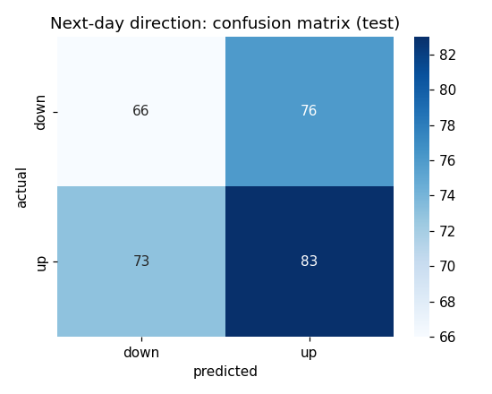
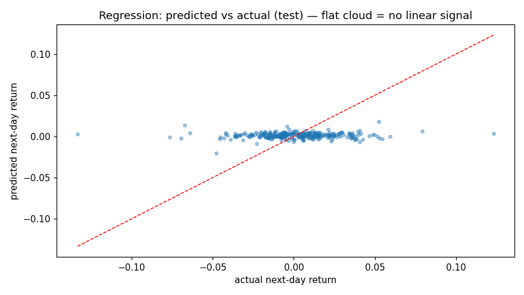
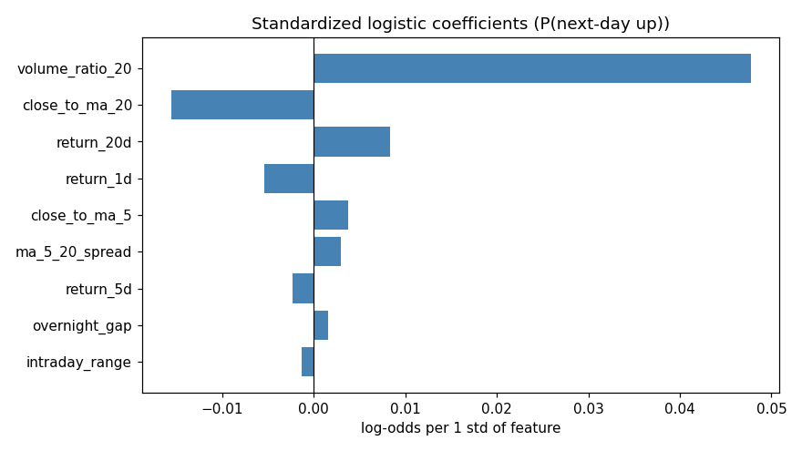
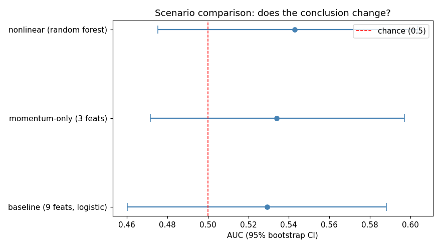

# TSM Next-Day Direction Forecast — Final Report

**Prepared for:** a retail investor / junior analyst who wants a daily up-or-down call.
**Date:** 2026-08-27
**Data:** TSM (NYSE ADR) daily OHLCV, 2020-01-01 → 2025-12-31 (1,486 usable trading days).

---

## 1. Executive summary

- We built a **next-day direction model** for TSM (will tomorrow's close be higher or
  lower than today's?), using only prior price and volume data.
- **The headline finding is a well-quantified negative:** the model scores at chance.
  Classification accuracy is ~50% (the majority-class baseline) and the AUC is ~0.53 with
  a 95% bootstrap interval of **0.46–0.59**, which straddles the 0.5 no-skill line.
- **The finding is robust, not an artefact.** Switching to a random forest or a
  momentum-only feature set leaves the AUC at chance, so no modelling choice hides an
  edge.
- **Recommendation:** do **not** trade this model as a directional signal. Treat it as a
  structured description of the data, and direct effort toward longer horizons, a larger
  feature universe, or a different (non-directional) objective.

---

## 2. Method

- **Targets.** Next-day return (`return_1d.shift(-1)`, regression track) and next-day
  direction (`close.shift(-1) > close`, classification track).
- **Features.** Nine leakage-safe, stationary predictors built in `src/features.py`:
  lag/rolling returns (`return_1d/5d/20d`), trend position (`close_to_ma_5`,
  `close_to_ma_20`, `ma_5_20_spread`), volume surge (`volume_ratio_20`), intraday range,
  and overnight gap. Price-scaled `ma_5/ma_20/vol_20` were excluded to avoid leaking the
  price level.
- **Split.** Chronological (first 80% train, last 20% test), never shuffled, so tomorrow's
  information never leaks into "past" training rows.
- **Models.** `StandardScaler → LogisticRegression` for direction, `StandardScaler →
  LinearRegression` for return size; random forest as a nonlinear check.

---

## 3. Results

### Direction (classification) — the project goal

| Metric | Value | Baseline (majority) |
| --- | --- | --- |
| Accuracy | 0.500 | 0.524 |
| Precision (up) | 0.522 | — |
| Recall (up) | 0.532 | — |
| F1 | 0.527 | — |
| **AUC** | **0.530** (CI 0.464–0.587) | 0.500 |

The confusion matrix is close to symmetric — the model is not finding a reliable up/down
separation.

### Return size (regression) — baseline track

- R² ≈ 0, RMSE = 0.0253 vs. a naive benchmark of 0.0253 (the return's own standard
  deviation). The linear model adds no predictive value for the *size* of tomorrow's move
  either.

### What the coefficients say (weakly)

`volume_ratio_20` is the largest positive coefficient (unusually heavy volume slightly
tilts the odds toward an up day) and `close_to_ma_20` is mildly negative (price extended
above its 20-day mean slightly precedes a down day). Both are directionally plausible but
far too small to trade on.

---

## 4. Sensitivity analysis

We compared the headline AUC across assumption scenarios, each with a bootstrap interval:

- **Baseline (9 features, logistic):** AUC 0.53
- **Momentum-only (3 features):** AUC ~0.52
- **Nonlinear (random forest):** AUC ~0.53

The conclusion is unchanged under every scenario: **no reliable edge.** This robustness is
itself the key result — it protects a decision-maker from over-trusting any single
configuration.

---

## 5. Assumptions & risks

| Assumption | Risk if it fails |
| --- | --- |
| Features use only information known by today's close | A leak would inflate metrics and be undetectable by eye |
| Features are stationary (ratio/return form) | A structural break in drift or volatility would invalidate a single global model |
| Relationship is stable across 2020–2025 | Regime shift would hurt transfer to new data |
| Decision threshold 0.5 with symmetric costs | Asymmetric up/down costs would call for threshold tuning |
| Test window (~300 days) is representative | Metrics are noisy; the bootstrap intervals above quantify this |

**Bottom line:** the model's limitations are explicit and quantified. It should not be
relied on for a tradeable directional edge.

---

## 6. Decision implications & next steps

1. **Do not deploy this as a trading signal** — accuracy is at chance and the AUC interval
   straddles 0.5.
2. **Use the model as a descriptive baseline** — it documents *why* a simple price/volume
   model cannot predict TSM's next-day direction, which is useful framing for future work.
3. **Next steps to pursue a real edge:** (a) longer-horizon targets (weekly/monthly),
   (b) a richer feature universe (options-implied, macro, cross-asset), (c) a
   classification target with more structure (e.g. "large up move" rather than "any up"),
   and (d) proper walk-forward validation and threshold calibration.
4. **Monitoring, if ever productionised:** track rolling AUC, feature drift (PSI), and
   data freshness — see `docs/monitoring_plan.md`.
